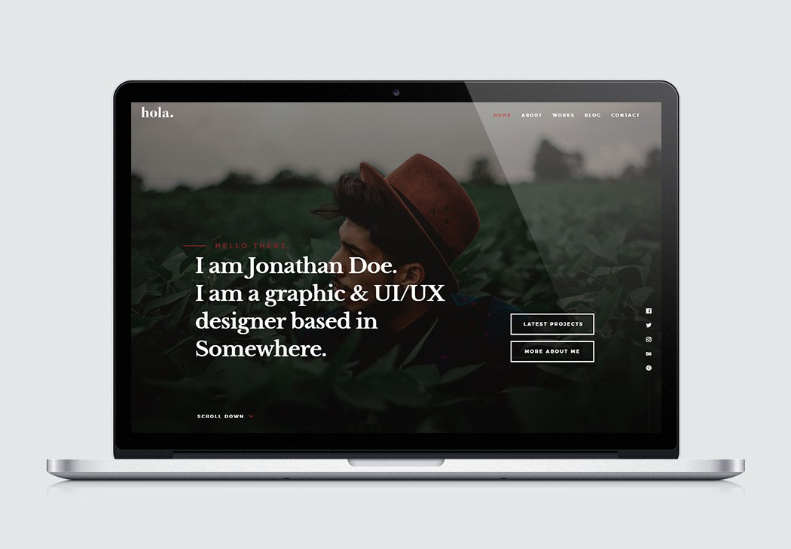
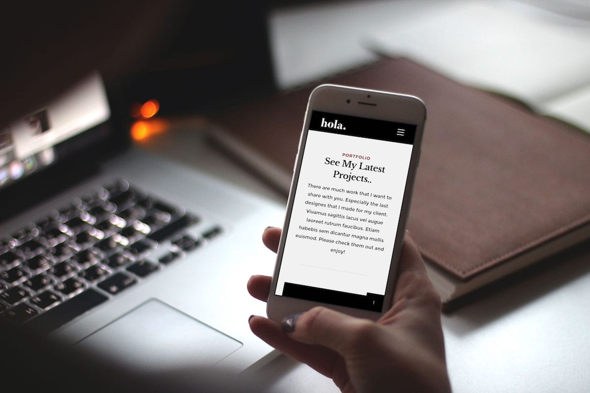

# Hola Theme



**Hola** modern and stylish vCard website template for [Grav CMS](http://github.com/getgrav/grav), originally made by [styleshout](https://www.styleshout.com/).  Designed to be a resume, vCard, portfolio template, it’s the perfect template for creative designers, developers, freelancers, photographer or any creative profession. It is fully responsive and retina/hi-dpi ready. It will look great on any devices from desktop to mobile phones. It has blog page templates, working contact form, stylish portfolio section and other features you will only find on premium templates. Built with clean and organized code, this template is also very easy to customize.

## Features

* HTML5 and CSS3
* Fully responsive layout
* Modern, stylish design
* Easy to customize
* Hundreds of icons avaliable
* Multiple page template types
* Retina ready
* Smooth scrolling home page nav 
* Stylish portfolio section
* Animated stats section
* @font-face custom web fonts
* Parallax type sections included
* Compatible with all major browsers
* Blueprints included for **EVERY** section
* Hundreds of customization options
* Robust menu with both onepage and regular pages support
* Complete blog layout



### Supported Page Templates

* Default view template `default.md`
* Error view template `error.md`
* Blog view template `blog.md`
* Blog item view template `item.md`
* Modular view templates: `modular.md`
  * Home Banner Modular view template - `home.md`
  * About Modular view template - `about.md`
  * Experience Modular view template - `experience.md`
  * Portfolio Modular view template - `works.md`
  * Services Modular view template - `services.md`
  * Testimonials Modular view template - `testimonials.md`
  * Resume Modular view template - `resume.md`
  * Blog Modular view template - `blog.md`
  * Call To Action Modular view template - `cta.md`
  * Stats Modular view template - `stats.md`
  * Basic One or Two Column Text Modular view template - `basic.md`


# Installation

Installing the Hola theme can be done in one of two ways. Our GPM (Grav Package Manager) installation method enables you to quickly and easily install the theme with a simple terminal command, while the manual method enables you to do so via a zip file. 

The theme by itself is useful, but you may have an easier time getting up and running by installing a skeleton. The skeleton can be found in [Hola Skeleton](https://github.com/devlom/grav-hola-skeleton) package which are self-contained repositories for a complete sites which include: sample content, configuration, theme, and plugins.

## GPM Installation (Preferred)

The simplest way to install this theme is via the [Grav Package Manager (GPM)](http://learn.getgrav.org/advanced/grav-gpm) through your system's Terminal (also called the command line).  From the root of your Grav install type:

    bin/gpm install hola

This will install the Hola theme into your `/user/themes` directory within Grav. Its files can be found under `/your/site/grav/user/themes/hola`.

## Manual Installation

To install this theme, just download the zip version of this repository and unzip it under `/your/site/grav/user/themes`. Then, rename the folder to `hola`. You can find these files either on [GitHub](https://github.com/devlom/grav-theme-hola) or via [GetGrav.org](http://getgrav.org/downloads/themes).

You should now have all the theme files under

    /your/site/grav/user/themes/hola

To make modifications, you can copy the `user/themes/hola/hola.yaml` file to `user/config/themes/` folder and modify, or you can use the admin plugin.

> NOTE: Do not modify the `user/themes/hola/hola.yaml` file directly or your changes will be lost with any updates

## Custom Logos

To add a custom logo, you should put the log into the `user/themes/hola/images/logo` folder.  Standard image formats are support (`.png`,`.jpg`, `.gif`, `.svg`, etc.).  Then reference the logo via the YAML like so:

```yaml
custom_logo:
    - name: 'my-logo.png'
custom_logo_mobile:
    - name: 'my-mobile-logo.png'    
```

Alternatively, you can you use the drag-n-drop "Custom Logo" field in the Hola theme options.


## Sources and Credits

Hola theme was originally designed by [styleshout](https://www.styleshout.com/) using the following resources as listed:

Fonts:
 - Montserrat Font (https://www.google.com/fonts/specimen/Montserrat)
 - Libre Baskerville Font (https://fonts.google.com/specimen/Libre+Baskerville) 

Icons:
 - Iconic font (https://iconmonstr.com/iconicfont/)

Stock Photos and Graphics:
 - Unsplash.com (https://unsplash.com/)
 - gratisography (https://gratisography.com/)
 
Javascript Files:

 - JQuery (http://jquery.com/)
 - Modernizr (http://modernizr.com/)
 - Waypoints (http://imakewebthings.com/jquery-waypoints/)
 - jQuery Placeholder (https://github.com/mathiasbynens/jquery-placeholder)
 - jQuery Validation Plugin (https://jqueryvalidation.org/)
 - pace js (http://github.hubspot.com/pace/)
 - Masonry (http://masonry.desandro.com/)
 - Imagesloaded (https://imagesloaded.desandro.com/)
 - Parallax.js (http://pixelcog.github.io/parallax.js/)
 - Slick Slider (http://kenwheeler.github.io/slick/)

Other: 
- Porting this template to GRAV was made possible with support of [davidhagenauer.com](http://davidhagenauer.com). Make sure to send cake!
- Conversion to Grav was handled by [Devlom](https://devlom.com) team.

Please take particular note of Styleshout's [licensing policy](http://www.styleshout.com/about-us/#remove-link) before removing any credits from the template.